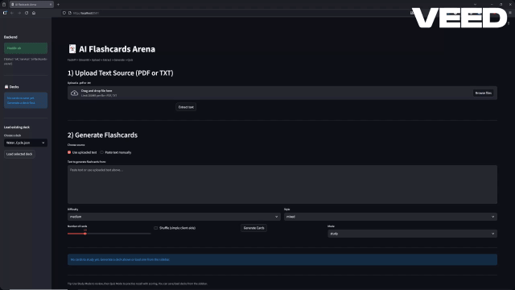

# 🃏 AI Flashcards Arena

<p align="center">
  
</p>

<p align="center">
  <b>Upload → Extract → Generate → Study → Quiz</b><br>
  Built with <b>FastAPI</b>, <b>OpenAI</b>, <b>Streamlit</b>, and <b>Docker</b>.
</p>

<p align="center">
  
  
  
  
  
</p>

---

AI Flashcards Arena is a smart flashcard generator that transforms PDFs or text into high-quality flashcards using OpenAI. It includes full study/quiz modes, local deck storage, and one-command Docker deployment.

---

## 📺 Demo

<p align="center">
  
</p>

---

## 🚀 Features

### ✔️ AI Flashcard Generation
- OpenAI-powered flashcards using **gpt-4.1-mini**
- Difficulty + style controls
- Clean JSON schema output
- Automatic fallback to the built-in rule-based generator

---

## 📄 File Upload & Text Extraction
- PDF extraction via **pdfplumber**
- TXT decoding via **chardet**
- Full text preview within the UI

---

## 🎓 Study & Quiz Modes
- Study mode with expandable questions
- Quiz mode with:
  - Free-response input
  - Intelligent, fuzzy-matched answer checking
  - Progress tracking + scoring
  - Skip, reveal, next, previous navigation

---

## 💾 Deck Storage
- Saves decks to `frontend/decks/*.json`
- Load any previous deck anytime
- Ideal for long-term study

---

## 🐳 Full Docker Support
- Backend (FastAPI) and Frontend (Streamlit) run in separate containers
- `.env` support for your **OpenAI API key**
- One-command deployment through Docker Compose

---

## 🏗️ Architecture

```text
flashcard_arena/
│
├── backend/               # FastAPI backend
│   ├── app.py             # API routes, AI logic, fallback generator
│   └── services/
│       └── cards.py       # Rule-based flashcard generator
│
├── frontend/              # Streamlit UI
│   ├── app.py             # Upload, extraction, generate, study, quiz
│   └── decks/             # Saved decks
│
├── assets/                # Demo images / GIFs
│   └── demo.gif
│
├── Dockerfile.backend
├── Dockerfile.frontend
├── docker-compose.yml
├── requirements.txt
└── .env.example
```

---

## 🛠️ Local Development Setup (No Docker)

```bash
# 1) Create & activate venv
python3 -m venv venv
source venv/bin/activate       # Mac/Linux
# OR
.\venv\Scripts\activate        # Windows

# 2) Install dependencies
pip install -r requirements.txt

# 3) Set your API key
export OPENAI_API_KEY=sk-...

# 4) Run backend
uvicorn backend.app:app --reload --port 8000

# 5) Run frontend
cd frontend
streamlit run app.py
```

Backend docs: http://127.0.0.1:8000/docs

---

## 🐳 Running with Docker (Recommended)

```bash
# 1) Create .env in the project root
OPENAI_API_KEY=sk-your-key-here

# 2) Start full stack
docker compose up --build
```

Services:

- **Frontend (Streamlit):** http://localhost:8501  
- **Backend (FastAPI):** http://localhost:8000/docs  

---

## 📡 API Endpoints

### `GET /health`
Health status.

### `POST /upload`
Extract text from PDF or TXT.

### `POST /cards/generate`
Generate flashcards using AI (with fallback).

**Request:**
```json
{
  "text": "source text",
  "n": 10,
  "difficulty": "medium",
  "style": "mixed"
}
```

**Response:**
```json
{
  "cards": [{ "q": "...", "a": "..." }],
  "mode": "ai",
  "fallback_error": null
}
```

---

## 🌐 Deployment

Deployable on:

- Fly.io (recommended)
- Railway
- Render
- HuggingFace Spaces
- DigitalOcean
- Any Docker-based environment

---

## 🧭 Roadmap

- Multiple-choice flashcards  
- Fill-in-the-blank (cloze deletion)  
- Auto-chunking long PDFs  
- Local vector search for flashcard lookup  
- Enhanced dark mode  
- “VS AI Mode” (arena-style challenge mode)  

---

## 📜 License

MIT — free to use, modify, and distribute.

---

## ✨ Author

Built by **Tony Nguyen** as part of an AI engineering + product portfolio.  
Showcasing: AI integration, full-stack architecture, containerization, design systems, and ML-assisted content generation.
